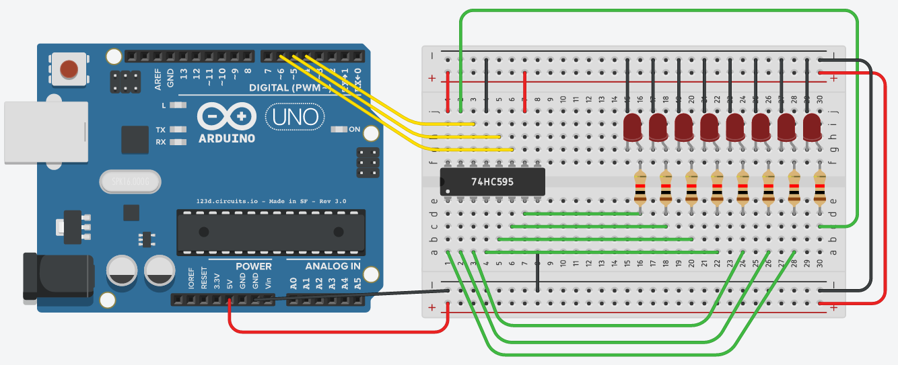

# ArduinoShiftOut
This is a small library for writing out values to a 74HC595 8 bit shift register.

The Arduino has only a limited amount of pins, therefore it might happen that you run out of pins.
For this case, the 74HC595 comes to the rescue. It is an 8 bit shift register. It allows you to write out 8 values by only using 3 pins on your Arduino. Furthermore you can daisy-chain several shift registers by still only using 3 Arduino Pins.

## Easy install (zip import)
The easiest way to install this library is by downloading the newest [release](https://github.com/andrealmeid/ArduinoShiftOut/releases) and then importing it.
You don't have to unzip it. Just open your Arduino IDE and navigate to *Sketch* > *Include Library* > *Add .ZIP* and then select the zip file.

## Manual install
Of course you can also install this library manually. To do so, download the newest release and unzip it. Then you have to copy the `ShiftOut` folder (NOT the `ShiftOut-x.y.z` folder) and copy it to your Arduino library folder:
* Windows: `My Documents\Arduino\libraries\`
* Mac and Linux: `Documents/Arduino/libraries/`

After that you just have to restart your Arduino IDE.

## Usage
If you have installed this library, you can include it by navigating to *Sketch* > *Include Library* > *ShiftOut*. This will add the line `#include <ShiftOut.h>` to your sketch (of course you could also write this line manually).

Now you can actually use this library:
``` c++
#include <ShiftOut.h>

// Init ShiftOut instance with a single chip
// If you want to use more shift registers, just modify this number
ShiftOut<1> shift;

int led = 0;

void setup() {
	Serial.begin(9600);
	// declare pins: data, clock, latch
	shift.begin(4, 6, 5);
}

void loop() {
	shift.setAllLow(); // set all to zero
	shift.setHigh(led); // set led to high
	shift.write(); // write out to 74HC595
	led = (led + 1) % shift.getDataWidth(); // increment led
	delay(250); // wait a bit
}
```


If you want to use two shift registers, you only have to change the declaration from `ShiftOut<1> shift;` to `ShiftOut<2> shift;` and then you just daisy chain your 74HC595. To daisy chain two 74HC595's, use a wire to connect the clock pin (11) of second shifter to the first one. Do the same with the latch pin (12). Now, connect the data pin (14) of the second one to the serial data output (9) of the first one.

## API
Depending on the number of chips, this library will use different data types.
If you are only using one chip, the type `ShiftType` will be an `unsigned byte` (`uint8_t`). For two chips it will be an `unsigned int` (`uint16_t`). For three and four chips it will be an `unsigned long` (`uint32_t`) and for 5 to 8 chips it will be an `unsigned long long` (`uint64_t`). More than eight chips are not supported yet.

This function must be called in the `setup` function. It is used to tell the library the pins it should use:
``` c++
void begin(int data, int clock, int latch)
```

Returns the number of outputs (bits in the state):
``` c++
uint16_t getDataWidth()
```

Gets/sets the value of the output with the given `id`. The value should be either `0` or `1`:
``` c++
boolean get(int id)
void set(int id, int value)
```

Sets/gets or inverts the output with the given `id`:
``` c++
void setHigh(int id)
void setLow(int id)
void invert(int id)
```

Sets all outputs to high/low or inverts all:
```
void setAllHigh()
void setAllLow()
void invert()
```

Finally writes out all data to the chips. *Must* be called to update the actual output. The state that was written out is returned:
``` c++
ShiftType write()
```

Sets the state to the given parameter and calls `write()`:
```
ShiftType write(ShiftType state)
```

## License

[MIT License](LICENSE)
